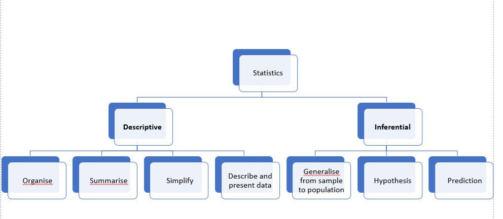
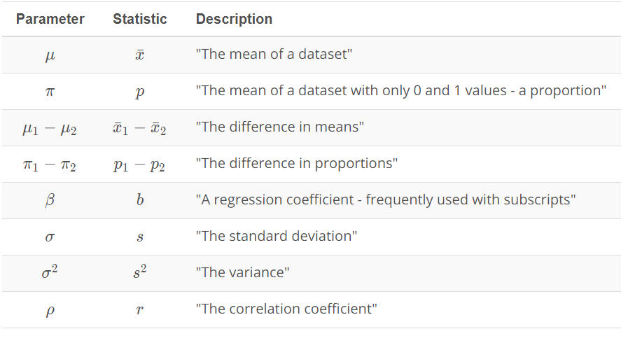

## Table of Content

1. [Statistics](#statistics) 
 - [Descriptive Statistics](descriptive)
 - [Inferential Statistics](inferential)
2. [Probability](#probability)
 - [Binomial Distribution](binomial)
 - [Conditional Probability](conditional)
 - [Bayes Rules](bayes)
 3. Distribution
 - Binomial Distribution
 - Normal Distribution


==========================================

```
Statistrics and Propability are differnet but strongly related. 
Statustics: Analyse data from past events to infer what those models or causes could be..
Propability (Practical Statistics): Predication on events in future based on Models and causes we assume.
```
  
# <a name="statistics"/> Statistics: </br>

Statistics plays a main role in the field of research. It is concerned with developing and studying different methods for collecting, analyzing and presenting the empirical data.

The field of statistics is composed of two broad categories- Descriptive and inferential statistics. Both of them give us different insights about the data. One alone doesn’t not help us much to understand the complete picture of our data but using both of them together gives us a powerful tool for description and prediction.

## <a name="descriptive"/>Descriptive Statistics: 

Descriptive statistics is about **describing our collected data** using:
1. **Measures of center** (Mean, Median, Mode) 
2. **Measures of spread** (Range, Interquartile Range IQR, Standard Deviation, Variance),[ 5 Numbers Summary ](docs/5_Number_Summary.xlsx)
 - *Range*: difference between Max and Min
 - *Interquartile Range*: difference between Q3 & Q1. Q1: first Quartile 25%, Q3: third Quartile 75% 
 - *Variance*: Avarage squared difference of each observation from the mean.
 - *Standard Deviation*: is the square root of the variance.
3. **Shape of our distribution**
4. **Outliers**. 

We can also use plots of our data to gain a better understanding.

## <a name="inferential"/> Inferential Statistics

Inferential Statistics is about using our collected data to **draw conclusions to a larger population**. Performing inferential statistics well requires that we take a sample that accurately represents our population of interest.

A common way to collect data is via a survey. However, surveys may be extremely biased depending on the types of questions that are asked, and the way the questions are asked. 

It is necessary to identify the:
1. **Population** - our entire group of interest. (200,000 persons)
2. **Parameter** - numeric summary about a population (Proportion of all 200,000 persons who are vegetarian)
3. **Sample** - subset of the population (1000 person)
4. **Statistic**- numeric summary about a sample (40%)

Statistics and parameters are generally the mean or proportion for a group. Statistics being the value for the sample. Parameters being the value for the population. The population is our entire group of interest, while a sample is the selected subset of the population.


# Distribution
A distribution shows the possible values a random variable can take and how frequently they occur. 

## Binomial Distribution:
A binomial distribution can be thought of as simply the probability of a **SUCCESS** or **FAILURE** outcome in an experiment or survey that is repeated multiple times. The binomial is a type of distribution that has two possible outcomes (the prefix “bi” means two, or twice). For example, a coin toss has only two possible outcomes: heads or tails and taking a test could have two possible outcomes: pass or fail.

The first variable in the binomial formula, n, stands for the number of times the experiment runs. The second variable, p, represents the probability of one specific outcome. For example, let’s suppose you wanted to know the probability of getting a 1 on a die roll. if you were to roll a die 20 times, the probability of rolling a one on any throw is 1/6. Roll twenty times and you have a binomial distribution of (n=20, p=1/6). SUCCESS would be “roll a one” and FAILURE would be “roll anything else.” If the outcome in question was the probability of the die landing on an even number, the binomial distribution would then become (n=20, p=1/2). That’s because your probability of throwing an even number is one half.

**The Binomial Distribution Formula** 


where n is the number of events, x is the number of "successes", and p is the probability of "success".

We can now use this distribution to determine the probability of things like:

- The probability of 3 heads occurring in 10 flips.
- The probability of observing 8 or more heads occurring in 10 flips.
- The probability of not observing any heads in 20 flips.


## Normal Distribution


A **sampling distribution** is the distribution of a statistic. The way you select the sample, that will affect then  Statistic.  [Practical sample distribution with Python](practice/Sampling_Distributions.ipynb)

**Note from Practical Sample distribution:** We found that for proportions (and also means, as proportions are just the mean of 1 and 0 values), the following characteristics hold.

The sampling distribution is centered on the original parameter value.

The sampling distribution decreases its variance depending on the sample size used. Specifically, the variance of the sampling distribution is equal to the variance of the original data divided by the sample size used. This is always true for the variance of a sample mean!


 


# Notation for Parameters vs. Statistics
The most common parameters and corresponding statistics: 



# <a name="probability"/> Probability: 
Probabiltiy is the chance an **event** to occur. Like flipping a coin. We have 2 probabilities involved; either getting a Head or a Tail. That means we have 2 possible events and we need to assign possiblility for each event.

- The probability of an event ```P ```  must be between 0 and 1, inclusive. ```1```  means absolute certainity of the event occuring while ```0```  means absolute certainity of the event not occuring

- The probability of the complement event  ```1- P ```  is 1 minus the probability of an event. That is the probability of all other possible events is 1 minus the probability an event itself. Therefore, the sum of all possible events is equal to 1.

- The probability of the composit event (Independent events),  ``` P*P*P*P ``` , is the product of those events.


# Resources
Udacity Data Analyst Nanodegree Program
https://www.statisticshowto.datasciencecentral.com/probability-and-statistics/binomial-theorem/binomial-distribution-formula/
